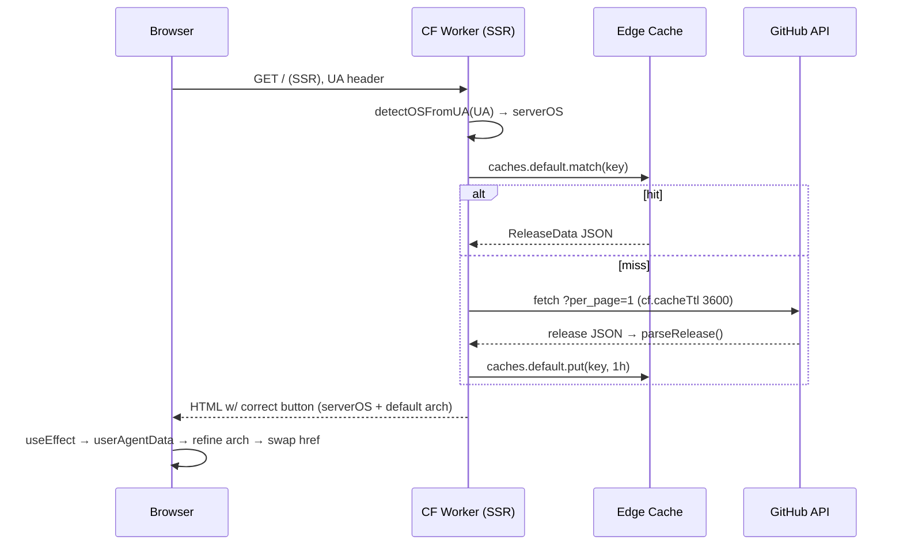

# Implementation Plan: GitHub Release Download URLs + OS Auto-Detect

## 1. Architectural Decision

### Approach (locked via gate)
- **Fetch**: `createServerFn({method:'GET'})` fetches GitHub API server-side; cached at CF edge (`fetch(..,{cf:{cacheTtl:3600}})` + `caches.default` guarded for dev). Called from route loaders → data present in SSR HTML. Protects the 60 req/hr/IP limit (research R3).
- **OS detect**: server-side from `User-Agent` request header (correct primary button in initial HTML, no flash) + client `navigator.userAgentData` refine for CPU arch (research R4/R5).
- **Asset match**: pattern-based — extension → OS/format, keyword regex → arch. Works before naming convention finalized, future-proof Tauri/Electron (research R2 de-risked).
- **/download page**: built dynamically from real assets, fallback card when none (research R1: repo has 0 releases today).

### Layering
```
src/lib/os.ts            (pure, isomorphic)   ← OS/arch detection
src/lib/releases.ts      (pure, isomorphic)   ← types, classify, parse, pick  ← imported by client + server
src/lib/releases.server.ts (server-only)      ← createServerFn: cache + UA header
src/features/download/    (client components)  ← hook + hero button
src/routes/index.tsx, download.tsx (loaders + render)
```
Pure logic isolated in `releases.ts`/`os.ts` so the client bundle never imports Worker globals (`caches`, request helpers). Server-only concerns confined to `releases.server.ts` (TanStack extracts it from the client bundle).

### Alternatives Considered
| Option | Pros | Cons | Verdict |
|--------|------|------|---------|
| Server fn + edge cache | SSR-correct, no flash, quota-safe | most code | ✅ Chosen (gate) |
| Client-side fetch | simplest | flash, JS-required, loading state | ❌ rejected at gate |
| Build-time fetch | fastest | stale, redeploy per release | ❌ rejected at gate |
| Exact filename map | precise | needs final names, brittle | ❌ rejected — pattern-match chosen |
| `caches.default` manual only | full control incl 404 cache | dev lacks `caches` | ⚠️ used WITH `cf.cacheTtl`, guarded |

### API facts (verified in node_modules)
- `@tanstack/react-start@1.168.16`. `import { createServerFn } from '@tanstack/react-start'`; `.handler(async()=>{})`.
- `import { getRequestHeader } from '@tanstack/react-start/server'` (re-exports `@tanstack/start-server-core` → `getRequestHeader(name): string|undefined`).
- vitest 4.1.5 + jsdom 28 + @testing-library present. `pnpm test` = `vitest run`.
- GitHub: `GET /repos/triasbrata/lazysheet/releases?per_page=1` (most-recent published, incl prerelease — chosen over `/latest` which 404s on prereleases; early-stage repo likely ships prereleases first). Requires `User-Agent` header or 403. CORS=*. Asset: `{name, browser_download_url, size}`.

### Design Diagram


## 2. Change Map

| # | File | Action | Description |
|---|------|--------|-------------|
| 1 | `src/lib/os.ts` | CREATE | `OS`/`Arch` types, `detectOSFromUA`, `detectClientOSArch` |
| 2 | `src/lib/os.test.ts` | CREATE | UA matrix unit tests |
| 3 | `src/lib/releases.ts` | CREATE | types, `classifyAsset`, `parseRelease`, `groupByOS`, `pickPrimaryAsset`, label helpers, URL consts |
| 4 | `src/lib/releases.test.ts` | CREATE | classify/parse/pick unit tests w/ fixtures |
| 5 | `src/lib/releases.server.ts` | CREATE | `getDownloadData` server fn (cache + UA) |
| 6 | `src/features/download/use-os-arch.ts` | CREATE | client hook: SSR initial → userAgentData refine |
| 7 | `src/features/download/download-button.tsx` | CREATE | hero primary button (label/icon/href from data) |
| 8 | `src/routes/index.tsx` | MODIFY | add loader; replace hero `<a>` (L76-84) w/ `<DownloadButton>`; drop local `RELEASES_URL` (L20) |
| 9 | `src/routes/download.tsx` | MODIFY | add loader; dynamic columns from assets; fallback card; highlight detected OS |

## 3. Interface Changes

### `src/lib/os.ts`
```ts
export type OS = 'macOS' | 'Windows' | 'Linux' | 'unknown'
export type Arch = 'arm64' | 'x64' | 'universal'

// server + client safe (pure string parse)
export function detectOSFromUA(ua: string | null | undefined): OS

// client only — guards `navigator`; uses userAgentData when present, else UA-string fallback
export function detectClientOSArch(): Promise<{ os: OS; arch: Arch | null }>
```
- `detectOSFromUA`: `/Windows/i`→Windows; `/Mac OS X|Macintosh/i` (and not iPhone/iPad)→macOS; `/Android/i`→unknown (mobile); `/iPhone|iPad/i`→unknown; `/Linux|X11/i`→Linux; else→unknown.
- `detectClientOSArch`: `nav.userAgentData?.getHighEntropyValues(['architecture','bitness'])` → `architecture==='arm'`→`arm64`; `'x86'&&bitness==='64'`→`x64`. OS from `userAgentData.platform` else from `navigator.userAgent` via `detectOSFromUA`. Minimal ambient type for `userAgentData` declared locally (not in TS DOM lib).

### `src/lib/releases.ts`
```ts
import type { OS, Arch } from './os'

export type AssetFormat = 'dmg'|'pkg'|'msi'|'exe'|'deb'|'rpm'|'AppImage'|'snap'|'tar.gz'
export interface ReleaseAsset { name: string; url: string; size: number; os: OS; arch: Arch; format: AssetFormat }
export interface ReleaseData { tag: string; name: string; htmlUrl: string; publishedAt: string; assets: ReleaseAsset[] }

export const REPO = 'triasbrata/lazysheet'
export const RELEASES_PAGE_URL = `https://github.com/${REPO}/releases`
export const LATEST_PAGE_URL = `${RELEASES_PAGE_URL}/latest`
export const GH_API_LATEST = `https://api.github.com/repos/${REPO}/releases?per_page=1`

export function classifyAsset(name: string): { os: OS; arch: Arch; format: AssetFormat } | null
export function parseRelease(json: unknown): ReleaseData | null
export function groupByOS(assets: ReleaseAsset[]): Record<'macOS'|'Windows'|'Linux', ReleaseAsset[]>
export function pickPrimaryAsset(assets: ReleaseAsset[], os: OS, arch: Arch | null): ReleaseAsset | null
export function osLabel(os: OS): string
export function archBadge(a: ReleaseAsset): string   // 'Apple Silicon'|'Intel'|'Universal'|'x64'|'ARM64'
export function formatLabel(a: ReleaseAsset): string  // 'DMG' | '.deb' | 'Installer (.exe)' | 'AppImage' ...
```
- `classifyAsset`: skip `/\.(sig|json|txt|sha256|sha512|blockmap|ya?ml|asc)$/`. Extension→OS/format (dmg/pkg/.app.tar.gz→macOS; msi/exe→Windows; AppImage/deb/rpm/snap→Linux). **Generic `.zip`/`.tar.gz` (no clear OS) → skipped (documented limitation, not silently claimed-covered).** Arch: `/(arm64|aarch64)/`→arm64; `/(x64|amd64|x86_64|x86-64|win64)/`→x64; `/universal/`→universal; else default (macOS→universal, other→x64).
- `parseRelease`: accept array (`?per_page=1`) or object (`/latest`); pick first `!draft`; map+filter assets via `classifyAsset`; return `ReleaseData` (assets may be `[]`); `null` if no release.
- `pickPrimaryAsset`: filter by OS; rank by `[arch||universal, universal, x64]` × per-OS format priority (macOS: dmg>pkg>tar.gz; Windows: exe>msi; Linux: AppImage>deb>rpm>snap); fall back to first-of-OS; `null` if none for OS.

### `src/lib/releases.server.ts`
```ts
import { createServerFn } from '@tanstack/react-start'
import { getRequestHeader } from '@tanstack/react-start/server'
import { detectOSFromUA, type OS } from './os'
import { parseRelease, GH_API_LATEST, type ReleaseData } from './releases'

export interface DownloadData { release: ReleaseData | null; serverOS: OS }
export const getDownloadData = createServerFn({ method: 'GET' })
  .handler(async (): Promise<DownloadData> => { /* UA→serverOS; fetchLatestCached() */ })
```
- `fetchLatestCached()`: `key=new Request('https://lazysheet.internal/latest-release')`; guard `typeof caches!=='undefined' && 'default' in caches`; on hit return `await hit.json()`; else `fetch(GH_API_LATEST,{headers:{Accept:'application/vnd.github+json','User-Agent':'lazysheet-landing'}, cf:{cacheTtl:3600,cacheEverything:true}})`; `res.ok ? parseRelease(await res.json()) : null`; `caches.default.put(key, Response(JSON, {cache-control 1h}))`.
- TS: `cf` on RequestInit + `caches.default` are Workers globals — cast (`as RequestInit & { cf?: ... }`) / local declare to avoid new dep. No `@cloudflare/workers-types` needed.

### `src/features/download/use-os-arch.ts`
```ts
import { useEffect, useState } from 'react'
import { detectClientOSArch, type OS, type Arch } from '#/lib/os'
export function useClientOSArch(initial: { os: OS; arch: Arch | null }): { os: OS; arch: Arch | null }
```
- SSR/first render returns `initial` (= server values → no hydration mismatch). `useEffect` runs `detectClientOSArch()`, `setState` only if changed.

### `src/features/download/download-button.tsx`
```tsx
import type { DownloadData } from '#/lib/releases.server'
export function DownloadButton({ data }: { data: DownloadData })
```
- `const {os,arch}=useClientOSArch({os:data.serverOS, arch:null})`; `asset=data.release?pickPrimaryAsset(...):null`; `href=asset?.url ?? data.release?.htmlUrl ?? LATEST_PAGE_URL`; icon by OS (`AppleMark`/`WindowsMark`/`LinuxMark`); label `os==='unknown'?'Download':'Download for '+osLabel(os)`. Same Tailwind classes as current L76-84 (`bg-[var(--st-green)]`…), `target="_blank" rel="noreferrer"`.

### Route loaders (both routes)
```ts
import { getDownloadData } from '#/lib/releases.server'
export const Route = createFileRoute('/...')({ component, loader: () => getDownloadData(), head: ... })
// component: const data = Route.useLoaderData()
```

## 4. Implementation Steps

### Step 1: OS detection lib
- **Files:** `src/lib/os.ts`, `src/lib/os.test.ts`
- **What:** types + `detectOSFromUA` + `detectClientOSArch` (+ local `userAgentData` type).
- **Test:** UA matrix — mac/win/linux/android/iphone/empty/bot → expected OS. `pnpm test` green.
- **Depends on:** none

### Step 2: Release parse/classify lib
- **Files:** `src/lib/releases.ts`, `src/lib/releases.test.ts`
- **What:** types, consts, `classifyAsset`, `parseRelease`, `groupByOS`, `pickPrimaryAsset`, label helpers.
- **Test:** fixtures — Tauri names (`*_universal.dmg`, `*_x64-setup.exe`, `*_amd64.deb`, `*_aarch64.rpm`, `*.AppImage`), Electron names, junk (`.sig`/`latest.json`→null), generic `.zip`→null; `parseRelease([])`/404-shape→null; `pickPrimaryAsset` arch+format priority; `groupByOS` order. `pnpm test` green.
- **Depends on:** Step 1 (imports `OS`/`Arch`)

### Step 3: Server fn (fetch + cache + UA)
- **Files:** `src/lib/releases.server.ts`
- **What:** `getDownloadData` + `fetchLatestCached` w/ dev guard + headers.
- **Test:** `pnpm build` typechecks (server-only extraction OK); no runtime test here (covered by manual verify Step 7).
- **Depends on:** Steps 1,2

### Step 4: Client hook + hero button
- **Files:** `src/features/download/use-os-arch.ts`, `src/features/download/download-button.tsx`
- **What:** `useClientOSArch` + `DownloadButton` (CLAUDE.md: custom comp → `src/features/`, NOT `src/components/`).
- **Test:** typecheck via build in Step 5/7.
- **Depends on:** Steps 1,2,3

### Step 5: Wire index.tsx hero
- **Files:** `src/routes/index.tsx`
- **What:** add `loader`; `Home` calls `Route.useLoaderData()`, threads `data` → `Hero` → `<DownloadButton data={data}/>` replacing L76-84; remove unused `RELEASES_URL` (L20) + unused `AppleMark` import if now only in button. Keep "Other downloads" `<Link>` + license `<p>`.
- **Test:** `pnpm dev` → `/` renders; button shows "Download for <serverOS>"; href = releases page (no real release → fallback) ; no console/hydration errors.
- **Depends on:** Step 4

### Step 6: Wire download.tsx dynamic table
- **Files:** `src/routes/download.tsx`
- **What:** add `loader`; build columns from `groupByOS(release.assets)` (order macOS,Windows,Linux); rows: `label=formatLabel`, `badge=archBadge`, `href=asset.url`; `highlight` = detected OS (via `useClientOSArch`, SSR=serverOS). When `release==null` or all groups empty → **fallback card**: message + button → `RELEASES_PAGE_URL`. Keep license note + "View all releases" link. Remove static `COLUMNS`/`RELEASES_URL`.
- **Test:** `pnpm dev` → `/download`; no release → fallback card visible; (happy path validated by fixtures Step 2 + manual JSON Step 7).
- **Depends on:** Steps 4,5

### Step 7: Final verification
- **Files:** none (verify only)
- **What:** `pnpm test` (all unit green), `pnpm build` (typecheck+SSR build clean). Manual: `pnpm dev` both pages, 404-fallback path. Happy-path UI: temporarily point `GH_API_LATEST` at a repo WITH releases OR inject a fixture to eyeball table+button, then revert. Cross-check Change Map (9 files).
- **Depends on:** all

## 5. Test Strategy

| Test Type | Scope | File |
|-----------|-------|------|
| Unit | `detectOSFromUA` matrix | `src/lib/os.test.ts` |
| Unit | `classifyAsset`/`parseRelease`/`pickPrimaryAsset`/`groupByOS` w/ Tauri+Electron+junk fixtures | `src/lib/releases.test.ts` |
| Build | SSR build + typecheck (server fn extraction, `cf`/`caches` casts) | `pnpm build` |
| Manual | both pages render; 404→fallback; arch refine swaps href | `pnpm dev` |

### Mock Requirements
- None for unit (pure fns + static JSON fixtures). No network in tests.
- Server fn + components NOT unit-tested (needs TanStack/Worker harness — out of scope); covered by build typecheck + manual. Documented, not silently skipped.

## 6. Migration & Rollback

### Forward
- Pure additive: 7 new files + 2 route edits. No schema/config/env/wrangler change. No new deps. Deploy via existing `pnpm deploy`.
- **No real release exists today** → live behavior = graceful fallback (buttons → releases page, /download → fallback card). Becomes fully dynamic automatically once first release published (≤1h edge-cache lag).

### Rollback
- `git revert` the commit. Pure UI/data layer, no state/migration. Static fallback identical to today's behavior, so even partial state is safe.

## 7. Risk Mitigation

| Risk (research) | Impact | Mitigation |
|------|--------|------------|
| R1 no releases yet | buttons dead | `parseRelease`→null → fallback to `RELEASES_PAGE_URL`/`htmlUrl`; /download fallback card. Verified Step 5/6. |
| R2 unknown naming | wrong/no match | pattern-match by ext+arch keyword (Tauri+Electron fixtures in Step 2). Generic `.zip/.tar.gz` skipped + documented. |
| R3 60 req/hr/IP | quota burn on Worker IP | `cf.cacheTtl 3600` + `caches.default` (1 upstream/hr/edge). UA header set (avoid 403). |
| R4 SSR flash | button flicker | serverOS in SSR HTML; client refine only swaps arch (`setState` if changed) → no OS flash. `useClientOSArch` seeds with server initial → no hydration mismatch. |
| R5 arch unknown | wrong arch link | default macOS→universal / others→x64; refine only when `userAgentData` present (Chromium); Safari/FF keep safe default. |
| dev lacks `caches` | crash in `pnpm dev` | guard `typeof caches!=='undefined'` → direct fetch in dev. |
| GitHub 403 (no UA) | null release | always send `User-Agent` header. |
| prerelease-only | `/latest` 404 | use `?per_page=1` (incl prereleases), `!draft` filter. |
| mobile visitor | no desktop build | mobile UA→`unknown`→generic "Download" → releases page. |
