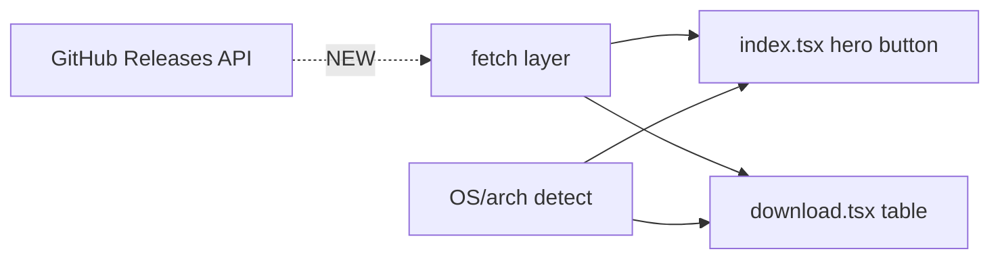

# Research Report: GitHub Release Download URLs + OS Auto-Detect

> Decisions locked (gate): (1) Server fn + edge cache, (2) Server UA + client arch refine, (3) Pattern-based asset match, (4) Dynamic /download table.

## 1. Existing Patterns

- **No data-fetching anywhere.** Grep for `createServerFn`, `loader`, `beforeLoad`, `useQuery`, `queryClient`, `fetch(` → zero hits in `src/`. App is purely static.
- Download links today are **all static** → point to the `releases/latest` *page*, not asset files.
  - `src/routes/download.tsx:14` — `const RELEASES_URL = 'https://github.com/triasbrata/lazysheet/releases/latest'`
  - `src/routes/download.tsx:24-56` — static `COLUMNS` array (macOS/Windows/Linux + arch rows), every `DownloadRow` (`download.tsx:58-77`) hrefs `RELEASES_URL`.
  - `src/routes/index.tsx:~74-91` — hero has hardcoded `<a href={RELEASES_URL}>` "Download for macOS" + `<Link to="/download">` "Other downloads".
- `index.tsx` also defines its own `RELEASES_URL` const (same value) — duplicated string.

## 2. Dependency Map

- Consumers of any new fetch/detect logic: `index.tsx` (1 primary button) + `download.tsx` (full asset table). Both currently independent, both hardcode the URL.
- No shared download/release module exists — candidate for new `src/lib/releases.ts` + `src/lib/os.ts`.

## 3. Interface Boundaries

- **Stack**: TanStack Start (`@tanstack/react-start`, `@tanstack/react-router`, `@tanstack/react-router-ssr-query` — all `latest`), React 19.2. SSR enabled (`Scripts` in `__root.tsx`, `shellComponent`).
- **Router** (`src/router.tsx`): no context, no queryClient wired. `defaultPreload: 'intent'`. (`ssr-query` dep present but unused — could wire if needed.)
- **Deploy**: Cloudflare Workers. `wrangler.jsonc` — `main: @tanstack/react-start/server-entry`, `nodejs_compat`, `compatibility_date 2025-09-02`. **No KV namespaces, no vars, no cache config.** Custom domain `lazysheet.brata.cloud`.
- **Server-fn capability**: `createServerFn` available (react-start). Route loaders available. Cloudflare `caches.default` (Cache API) usable with zero binding; `fetch(url, { cf: { cacheTtl, cacheEverything } })` also available on Workers.

## 4. Data Flow (GitHub API facts — probed live)

- `GET /repos/triasbrata/lazysheet/releases/latest` → **HTTP 404** (no published full release).
- `GET /repos/triasbrata/lazysheet/releases` → `[]` (0 releases). `GET .../tags` → 0 tags.
- Repo confirmed **public**, default branch `main`, exists.
- **Rate limit (unauth): 60 req/hr per IP.** Headers `x-ratelimit-*` present, `etag` supported (conditional requests don't cost quota).
- **CORS**: `access-control-allow-origin: *` → **browser can fetch GitHub API directly** (no proxy needed).
- Asset URL shape (when releases exist): each asset has `browser_download_url` + `name`. OS/arch must be inferred from `name` (e.g. `*.dmg`, `*-x64.exe`, `*-arm64.AppImage`, `*.deb`, `*.rpm`).

## 5. Test Landscape

- `pnpm test` = `vitest run`. **No existing test files** found in `src/`. No test patterns to match. (Greenfield for tests.)

## 6. Constraints & Risks

| # | Constraint / Risk | Detail |
|---|---|---|
| R1 | **No releases exist yet** | `/latest` is 404 today. Feature MUST gracefully fall back to `releases` page and not break the page. Real asset URLs only appear after first release published. |
| R2 | **Unknown asset naming convention** | Cannot build OS/arch→asset mapping without knowing how the build pipeline names assets. Convention drives the entire mapping table. **BLOCKER for plan.** |
| R3 | **GitHub 60 req/hr/IP** | If fetched **server-side on CF Worker**, ALL visitors share Worker egress IPs → quota burns fast → MUST cache (Cache API / KV / build-time). If fetched **client-side**, each visitor uses own IP → effectively safe. |
| R4 | **SSR hydration** | Client-only OS detect (`navigator`) → button flashes/needs default during SSR. Server-side UA-header detect avoids flash but UA string lacks reliable arch (x64 vs ARM). |
| R5 | **Arch detection limits** | `navigator.userAgentData.getHighEntropyValues(['architecture'])` (Chromium only, async). UA string alone can't distinguish Apple Silicon vs Intel, or Win x64 vs ARM64 reliably. |
| R6 | No KV/cache infra wired | wrangler.jsonc has none. Server-cache option needs either Cache API (no binding) or adding KV. |

## 7. Prior Art

- Git log: `8ee4e8f update favicon`, `e2f8b4b update readme`, `440d9ab Initial commit`. No prior download/release-fetch attempt. Greenfield.

## 8. Open Questions

1. **[BLOCKER] Asset naming convention** — what will release assets be named? Need the exact pattern per OS/arch to build the mapping (e.g. `LazySheet_<ver>_universal.dmg`, `LazySheet_<ver>_x64-setup.exe`, `lazysheet_<ver>_amd64.deb`, `*.AppImage`, `*.rpm`, `*-arm64.*`). Is the build Tauri / Electron? (naming differs.)
2. **Fetch strategy** — pick one (Plan decision, options ranked in §6 R3):
   - (a) **Client-side fetch** on mount — simplest, no quota risk, but loading state + JS-required.
   - (b) **Server fn + Cloudflare Cache API** (TTL ~1h) — SSR-ready, no flash, 1 upstream req/hr/edge, no new binding.
   - (c) **Build-time fetch** — fastest/zero runtime calls, but stale until redeploy; needs redeploy-on-release.
3. **OS detect strategy** — client `navigator` (flash risk) vs server `User-Agent` header (no flash, weak arch). Hybrid: server UA for OS, client upgrade for arch?
4. **Fallback behavior** when `/latest` 404 or asset missing for detected OS → link to `releases` page? Show all? Disable?
5. **Should `download.tsx` rows become dynamic** (built from real assets) or stay static labels that just get correct hrefs? Current rows list specific variants (6 Windows, 7 Linux) that may not match actual assets.
