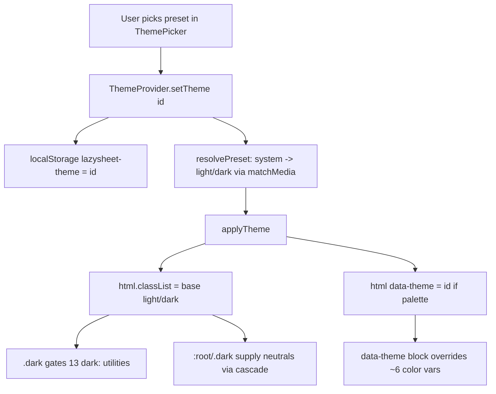

# Implementation Plan: Theme Customization Feature

## 1. Architectural Decision

### Approach — "Two-facet preset, partial-override CSS, registry-driven UI"

A **preset** has two facets (research §2):
1. **Palette identity** → applied via `data-theme="<id>"` attribute on `<html>`.
2. **Light/dark base** → applied via the existing `.dark` / `.light` class on `<html>` (REQUIRED so the 13 `dark:` Tailwind utilities keep working — research §2).

So a dark palette renders as `<html class="dark" data-theme="blue-dark">`, a light palette as `<html class="light" data-theme="blue-light">`. Default presets keep current behavior: Default Light = `:root` (no attr, `.light`), Default Dark = `.dark` (no attr).

**CSS uses PARTIAL override (the key insight).** CSS custom properties cascade on the same `<html>` element: `:root` sets all 31 vars, `.dark` overrides the dark-specific ones, and each `[data-theme="X"]` block overrides ONLY the ~6 color-carrying vars. A palette block omits neutrals → they fall back to `:root` (light palettes) or `.dark` (dark palettes, which carry `.dark`). This means:
- Contrast safety: neutrals reuse the already-proven gray values. Low risk.
- Extensibility: adding a palette = one small ~6-line CSS block + one registry entry. No component edits. **Meets the hard constraint.**

Specificity note: `[data-theme="X"]` (0,1,0) ties with `.dark` (0,1,0); the palette block must be authored AFTER `.dark` in `App.css` so source order breaks the tie in its favor.

**Color vars overridden per palette (minimal accent-swap, contrast-safe):**
`--primary`, `--primary-foreground`, `--ring`, `--sidebar-primary`, `--sidebar-ring`. Neutrals (bg/card/muted/border/etc) inherited. (Answers research open-Q on palette scope: accent-swap within full-cascade.)

**UI:** a registry-driven dropdown modeled on `LanguageToggle` (research §7 — closest precedent), replacing `ModeToggle`. Keeps testids `theme-toggle-btn` + `theme-item-<id>` for e2e backward-compat.

**i18n extensibility:** palette label = `t(colorKey) + " " + t(baseLabel)` (e.g. "Blue" + "Dark"). Adding a palette color needs ONE new key per locale (`theme.colors.blue`), not two — defaults reuse existing `theme.light/dark/system`.

**localStorage:** key `lazysheet-theme` unchanged. Old values `"light"|"dark"|"system"` are still valid preset ids → zero migration. Unknown stored id → fallback `"system"`.

### Alternatives Considered
| Option | Pros | Cons | Verdict |
|--------|------|------|---------|
| A: data-theme attr + `.dark` class, partial-override CSS | Keeps 13 `dark:` utils working; extensible; contrast-safe; no migration | Specificity ordering discipline needed | ✅ Chosen |
| B: Full var block per palette (no inheritance) | Total control per palette | 31 vars × N blocks; contrast risk; verbose | ❌ Verbose, error-prone |
| C: Pure class-per-theme (`.theme-blue-dark`), drop data-theme | Single mechanism | Class explosion; still needs `.dark` too; messy compounding | ❌ Worse than A |
| D: JS-injected inline CSS vars (no static CSS) | Fully dynamic | FOUC, harder to audit, loses Tailwind `dark:` gating | ❌ Over-engineered |

### Design Diagram


## 2. Change Map

| # | File | Action | Description |
|---|------|--------|-------------|
| 1 | `src/lib/themes.ts` | CREATE | Preset types + registry (single source of truth) |
| 2 | `src/lib/themes.test.ts` | CREATE | Registry invariants UT |
| 3 | `src/components/theme-provider.tsx` | MODIFY | Generalize to preset ids; data-theme + base class; system matchMedia listener; fallback |
| 4 | `src/components/theme-provider.test.tsx` | MODIFY | Update assertions for preset application |
| 5 | `src/components/theme-picker.tsx` | CREATE | Registry-driven dropdown (replaces ModeToggle) |
| 6 | `src/components/theme-picker.test.tsx` | CREATE | Picker UT |
| 7 | `src/components/mode-toggle.tsx` | DELETE | Superseded by theme-picker |
| 8 | `src/components/mode-toggle.test.tsx` | DELETE | Superseded by theme-picker.test |
| 9 | `src/App.css` | MODIFY | Add `[data-theme="..."]` palette blocks after `.dark` |
| 10 | `src/components/TitleBar.tsx` | MODIFY | Swap `ModeToggle` → `ThemePicker` |
| 11 | `src/locales/en.json` | MODIFY | Add `theme.colors.*`, `theme.customize` |
| 12 | `src/locales/id.json` | MODIFY | Same keys (Indonesian) |
| 13 | `src/locales/zh.json` | MODIFY | Same keys (Chinese) |
| 14 | `src/locales/es.json` | MODIFY | Same keys (Spanish) |
| 15 | `e2e/specs/11-theme.e2e.ts` | MODIFY | Keep light/dark tests; add palette-select test |

> Pre-implementation check (Step 0): grep `ModeToggle` to confirm `TitleBar.tsx` is the ONLY importer before deleting.

## 3. Interface Changes

> EXACT names + types. NO bodies.

### New types + registry — `src/lib/themes.ts`
```
type ThemeBase = "light" | "dark"

interface ThemePreset {
  id: string                 // unique; localStorage value; e.g. "blue-dark"
  base: ThemeBase            // drives .dark/.light class
  palette: boolean           // true => set data-theme=id and has CSS block; false => default light/dark
  labelKey?: string          // for non-palette presets: "theme.light" | "theme.dark"
  colorKey?: string          // for palette presets: e.g. "theme.colors.blue"
  swatch: string             // oklch/hex for the UI dot
}

type ThemeId = string                       // preset id
type ThemeSelection = ThemeId | "system"    // what's stored / passed to setTheme

const THEME_PRESETS: ThemePreset[]          // exported registry
const DEFAULT_SELECTION: ThemeSelection = "system"
const STORAGE_KEY = "lazysheet-theme"

function getPreset(id: string): ThemePreset | undefined
function resolveBase(selection: ThemeSelection, prefersDark: boolean): ThemePreset
  // "system" -> getPreset("light"|"dark"); known id -> that preset; unknown -> getPreset("light"/"dark") per prefersDark fallback
```

Registry entries (v1 — Material example set; trivially extendable later):
```
{ id:"light",  base:"light", palette:false, labelKey:"theme.light",  swatch:"oklch(1 0 0)" }
{ id:"dark",   base:"dark",  palette:false, labelKey:"theme.dark",   swatch:"oklch(0.205 0 0)" }
// palette pairs (color shown is the light-base primary swatch):
{ id:"blue-light",   base:"light", palette:true, colorKey:"theme.colors.blue",   swatch:<blue 600> }
{ id:"blue-dark",    base:"dark",  palette:true, colorKey:"theme.colors.blue",   swatch:<blue 300> }
{ id:"teal-light",   base:"light", palette:true, colorKey:"theme.colors.teal",   swatch:<teal 600> }
{ id:"teal-dark",    base:"dark",  palette:true, colorKey:"theme.colors.teal",   swatch:<teal 300> }
{ id:"purple-light", base:"light", palette:true, colorKey:"theme.colors.purple", swatch:<purple 600> }
{ id:"purple-dark",  base:"dark",  palette:true, colorKey:"theme.colors.purple", swatch:<purple 300> }
{ id:"green-light",  base:"light", palette:true, colorKey:"theme.colors.green",  swatch:<green 600> }
{ id:"green-dark",   base:"dark",  palette:true, colorKey:"theme.colors.green",  swatch:<green 300> }
{ id:"orange-light", base:"light", palette:true, colorKey:"theme.colors.orange", swatch:<orange 600> }
{ id:"orange-dark",  base:"dark",  palette:true, colorKey:"theme.colors.orange", swatch:<orange 300> }
{ id:"pink-light",   base:"light", palette:true, colorKey:"theme.colors.pink",   swatch:<pink 600> }
{ id:"pink-dark",    base:"dark",  palette:true, colorKey:"theme.colors.pink",   swatch:<pink 300> }
```
Material reference hexes (Implement converts → oklch for App.css + swatch):
blue 600 `#1E88E5` / 300 `#90CAF9`; teal 600 `#00897B` / 300 `#4DB6AC`; purple 600 `#8E24AA` / 300 `#CE93D8`; green 600 `#43A047` / 300 `#A5D6A7`; orange 600 `#FB8C00` / 300 `#FFCC80`; pink 600 `#D81B60` / 300 `#F48FB1`. (Source: material-theme.com palette; example set — more added later via same pattern.)

### ThemeProvider context — `src/components/theme-provider.tsx`
```
type ThemeProviderState = {
  theme: ThemeSelection
  setTheme: (theme: ThemeSelection) => void
}
function ThemeProvider(props: { children; defaultTheme?: ThemeSelection; storageKey?: string })
const useTheme: () => ThemeProviderState
```
(Public shape preserved: `theme` + `setTheme`. `Theme` type widened from union → `ThemeSelection`.)

### ThemePicker — `src/components/theme-picker.tsx`
```
function ThemePicker(): JSX.Element   // default export name ThemePicker
```
- Trigger: ghost icon button `h-7 w-7`, `data-testid="theme-toggle-btn"`, lucide `Palette` icon, `aria-label` from `t("theme.customize")`.
- Content: `DropdownMenuContent align="end"`.
  - Group 1 (defaults + system): items for `light`, `dark`, `system`.
  - `DropdownMenuSeparator` + `DropdownMenuLabel` = `t("theme.customize")`.
  - Group 2: one item per palette preset, mapped from `THEME_PRESETS.filter(p=>p.palette)`.
- Each item: `data-testid={"theme-item-"+id}`, swatch dot (`<span style={{backgroundColor: swatch}}>`), label, check icon when active.
- Label logic: palette → `${t(colorKey)} ${t(base==="dark"?"theme.dark":"theme.light")}`; else `t(labelKey)`; system → `t("theme.system")`.

### i18n keys (all 4 locales)
```
theme.customize : "Customize" | "Sesuaikan" | "自定义" | "Personalizar"
theme.colors.blue   / teal / purple / green / orange / pink
  en: Blue, Teal, Purple, Green, Orange, Pink
  id: Biru, Tosca, Ungu, Hijau, Oranye, Merah Muda
  zh: 蓝色, 青色, 紫色, 绿色, 橙色, 粉色
  es: Azul, Verde azulado, Morado, Verde, Naranja, Rosa
```
(Existing `theme.toggle/light/dark/system` retained.)

## 4. Implementation Steps

> Each step = production code + UT together (test-alongside). Translate pseudo → idiomatic TS/React.

### Step 0: Pre-flight verification (no code)
- **Logic:**
  ```
  1. grep -rn "ModeToggle" src/  -> expect only TitleBar.tsx + mode-toggle files
  2. grep -rn "from \"@/components/mode-toggle\"" src/ -> confirm single importer
  3. if other importers exist -> STOP, add to change map (deviation protocol)
  ```
- **Depends on:** none

### Step 1: Theme registry + types
- **Files:** `src/lib/themes.ts`, `src/lib/themes.test.ts`
- **Signatures:** `ThemeBase`, `ThemePreset`, `ThemeSelection`, `THEME_PRESETS`, `STORAGE_KEY`, `DEFAULT_SELECTION`, `getPreset(id)`, `resolveBase(selection, prefersDark)`
- **Logic (pseudo):**
  ```
  1. define types per §3
  2. define THEME_PRESETS array per §3 (light, dark, 6 color pairs)
  3. getPreset(id) -> THEME_PRESETS.find(p => p.id === id)
  4. resolveBase(selection, prefersDark):
     a. if selection === "system" -> return getPreset(prefersDark ? "dark":"light")
     b. p = getPreset(selection); if p -> return p
     c. fallback -> getPreset(prefersDark ? "dark":"light")
  ```
- **Test (same step):** `themes.test.ts` — (a) ids unique; (b) `light`+`dark` present, palette:false; (c) every palette preset has colorKey + swatch + base in {light,dark}; (d) `resolveBase("system",true)`→dark preset, `("system",false)`→light; (e) `resolveBase("blue-dark",_)`→blue-dark; (f) `resolveBase("__nope__",true)`→dark preset.
- **Depends on:** none

### Step 2: ThemeProvider generalization
- **Files:** `src/components/theme-provider.tsx`, `src/components/theme-provider.test.tsx`
- **Signatures:** `ThemeProviderState.theme: ThemeSelection`, `setTheme(theme: ThemeSelection)`, `ThemeProvider({children, defaultTheme?, storageKey?})`, `useTheme()`
- **Logic (pseudo):**
  ```
  1. import THEME_PRESETS helpers, ThemeSelection, STORAGE_KEY, DEFAULT_SELECTION from @/lib/themes
  2. state init: localStorage.getItem(storageKey) || defaultTheme (default = "system")
  3. applyTheme(selection):
     a. root = document.documentElement
     b. prefersDark = matchMedia("(prefers-color-scheme: dark)").matches
     c. preset = resolveBase(selection, prefersDark)
     d. root.classList.remove("light","dark")
     e. root.removeAttribute("data-theme")
     f. root.classList.add(preset.base)            // "light" | "dark"
     g. if preset.palette -> root.setAttribute("data-theme", preset.id)
  4. useEffect[selection]: applyTheme(selection)
  5. useEffect (mount): if current theme === "system", add matchMedia change listener -> re-applyTheme("system"); cleanup on unmount/selection change
  6. setTheme: persist to localStorage + setState
  7. keep initialState no-op + useTheme guard unchanged
  ```
- **Test (same step):** update `theme-provider.test.tsx` — keep 3 existing (children render, useTheme-outside no-op ×2). ADD: (a) defaultTheme="dark" → `html.classList.contains("dark")`; (b) setTheme("blue-dark") → `html.getAttribute("data-theme")==="blue-dark"` AND `classList.contains("dark")`; (c) setTheme("light") → no `data-theme`, no `.dark`; (d) setTheme("blue-light") → `data-theme==="blue-light"`, no `.dark`. (Use the existing `ThemeConsumer` harness pattern; trigger setTheme via a button as current tests do.)
- **Depends on:** Step 1

### Step 3: CSS palette blocks
- **Files:** `src/App.css`
- **Logic (pseudo):**
  ```
  1. AFTER the .dark {...} block (so source order wins specificity ties), add one block per palette id:
     [data-theme="blue-light"]  { --primary:<blue600 oklch>; --primary-foreground:oklch(0.985 0 0);
                                   --ring:<blue500 oklch>; --sidebar-primary:<blue600 oklch>; --sidebar-ring:<blue500 oklch>; }
     [data-theme="blue-dark"]   { --primary:<blue300 oklch>; --primary-foreground:oklch(0.205 0 0);
                                   --ring:<blue400 oklch>; --sidebar-primary:<blue300 oklch>; --sidebar-ring:<blue400 oklch>; }
     ... repeat for teal, purple, green, orange, pink (light+dark) ...
  2. convert Material hexes (§3) -> oklch (Tailwind v4 native). light primary = 600 strength + light foreground; dark primary = 300 tint + dark foreground.
  3. do NOT override neutrals -> they cascade from :root (light) / .dark (dark).
  ```
- **Test (same step):** No unit test for raw CSS (no JS). Covered by Step 2 (attr applied) + Step 6 e2e (visual class/attr). Note in progress file that CSS correctness is e2e-verified.
- **Depends on:** Step 1 (ids must match)

### Step 4: ThemePicker component
- **Files:** `src/components/theme-picker.tsx`, `src/components/theme-picker.test.tsx`
- **Signatures:** `ThemePicker(): JSX.Element`
- **Logic (pseudo):**
  ```
  1. useTheme() -> {theme, setTheme}; useTranslation() -> t
  2. trigger Button ghost h-7 w-7, data-testid="theme-toggle-btn", lucide Palette icon, aria-label t("theme.customize")
  3. content align="end":
     a. items for light, dark, system (label = t(labelKey)/t("theme.system")), each data-testid theme-item-<id>, check icon if theme===id
     b. DropdownMenuSeparator + DropdownMenuLabel t("theme.customize")
     c. THEME_PRESETS.filter(palette).map -> item: swatch dot span style backgroundColor, label `${t(colorKey)} ${t(base==="dark"?"theme.dark":"theme.light")}`, data-testid theme-item-<id>, check if active
  4. onClick item -> setTheme(id)
  ```
- **Test (same step):** `theme-picker.test.tsx` — (a) renders trigger button; (b) open → light/dark/system visible; (c) open → at least one palette item (e.g. `theme-item-blue-dark`) present; (d) click `theme-item-blue-dark` does not throw; (e) total menuitems === defaults(3) + palette count from registry (compute from `THEME_PRESETS`, NOT hardcoded). Use `renderWithProviders`.
- **Depends on:** Step 1, Step 2

### Step 5: Wire into TitleBar + delete ModeToggle
- **Files:** `src/components/TitleBar.tsx`, delete `src/components/mode-toggle.tsx`, delete `src/components/mode-toggle.test.tsx`
- **Logic (pseudo):**
  ```
  1. TitleBar: replace `import { ModeToggle } from "@/components/mode-toggle"` -> `import { ThemePicker } from "@/components/theme-picker"`
  2. replace <ModeToggle /> usage -> <ThemePicker />
  3. delete mode-toggle.tsx + mode-toggle.test.tsx
  4. grep confirm no remaining ModeToggle references
  ```
- **Test (same step):** No new UT (TitleBar has its own coverage if any). Covered by theme-picker.test + e2e. Run full `bun test` (or vitest) to confirm nothing imports deleted file.
- **Depends on:** Step 4

### Step 6: i18n + e2e
- **Files:** `src/locales/{en,id,zh,es}.json`, `e2e/specs/11-theme.e2e.ts`
- **Logic (pseudo):**
  ```
  1. add theme.customize + theme.colors.{blue,teal,purple,green,orange,pink} to all 4 locales (§3 values)
  2. e2e: KEEP existing dark/light class tests (they still pass — defaults use .dark class)
  3. e2e: ADD test "switches to a color palette and sets data-theme + base class":
     a. openDropdownItem(T.themeToggleBtn, "theme-item-blue-dark")
     b. assert document.documentElement.getAttribute("data-theme") === "blue-dark"
     c. assert document.documentElement.classList.contains("dark") === true
  ```
- **Test (same step):** the e2e spec IS the test. Unit: i18n is data; ThemePicker test (Step 4) already exercises label lookup.
- **Depends on:** Step 4

## 5. Test Strategy

| Test Type | Scope | Files |
|-----------|-------|-------|
| Unit | registry invariants | `src/lib/themes.test.ts` |
| Unit | provider apply logic (class + data-theme) | `src/components/theme-provider.test.tsx` |
| Unit | picker render/items/click | `src/components/theme-picker.test.tsx` |
| e2e | default light/dark class + palette data-theme | `e2e/specs/11-theme.e2e.ts` |

### Mock Requirements
- None new. Provider tests drive real `document.documentElement` (jsdom). `matchMedia` may need a jsdom stub — check existing setup; if absent, stub `window.matchMedia` in the provider test (return `{matches:false, addEventListener, removeEventListener}`).

## 6. Migration & Rollback

### Forward
- No DB/config. Pure frontend. localStorage key reused; old `light|dark|system` values remain valid → seamless.

### Rollback
- Revert the branch. localStorage may hold a palette id (e.g. `blue-dark`); on old code `resolveBase` absent → old provider would `classList.add("blue-dark")` (harmless no-op class, unstyled) → falls back to `:root` light. Acceptable. (Optional: note for users to reset theme.)

## Revision R1 — Real Material THEME palettes (deviation)

Original v1 shipped 6 Material **Design** accent-swaps. User clarified: wants Material **Theme** named schemes from material-theme.com (Palenight, Deep Ocean, Forest, Sky Blue, Sandy Beach, …). These are FULL color schemes (distinct backgrounds), not accent swaps.

**Changes from approved plan:**
- **Palette model:** each Material Theme palette = ONE full scheme (not light/dark pairs). `base` ("light"/"dark") derived from background OKLCH luminance (drives `.dark` class for the 13 `dark:` utilities).
- **CSS:** FULL var block per palette (all 31 vars overridden), not partial accent-swap. Generated deterministically (token→var map + hex→oklch) from scraped palettes.json.
- **Registry:** replace 6 color pairs with 23 palettes. `ThemePreset` gains `name?: string` (proper-noun label, e.g. "Palenight"); `colorKey` removed (proper nouns not translated).
- **i18n:** remove `theme.colors.*`; keep `theme.customize`. Palette labels = `preset.name` (same all locales).
- **Picker:** label = palette `name` for palettes, `t(labelKey)` for defaults; swatch = palette background. ~26 items → add `max-h-[...] overflow-y-auto` scroll on content.
- **Tests:** themes.test invariants change (no colorKey/pairs; each palette has name+swatch+base; ids unique; ≥20 palettes). picker count = 3 defaults + palette count (already registry-driven). provider tests unchanged (mechanism identical — data-theme + base class).

**Token → shadcn var mapping** (for adding future palettes by hand):
bg→background; fg→foreground; Second Background→card/muted/secondary; Contrast→popover/sidebar; Accent→primary/ring/sidebar-primary/sidebar-accent-ring; Active/Highlight→accent/sidebar-accent; Border→border/input; Text/Disabled→muted-foreground; Error/Red→destructive; Green/Yellow/Blue/Red/Purple→chart-1..5; primary-foreground = white/black by accent luminance.

Generated artifacts: `/tmp/gen_registry_ts.txt` (23 entries), `/tmp/gen_palettes.css` (23 blocks).

## 7. Risk Mitigation

| Risk | Impact | Mitigation |
|------|--------|------------|
| `dark:` utilities break on dark palettes (research §2) | Buttons/tabs/dropdowns lose dark styling | Dark presets carry `.dark` class via `preset.base`; Step 2 test asserts it |
| CSS specificity tie `[data-theme]` vs `.dark` | Palette vars not applied | Author palette blocks AFTER `.dark`; documented in Step 3 |
| Tests hardcoding "3 menu items" / dark class (research §5) | CI red | Step 4 computes count from registry; Step 6 keeps default e2e, adds palette e2e |
| `matchMedia` undefined in jsdom | provider test crash | Stub in test setup (§5 mocks) |
| `sonner.tsx` uses next-themes (research §3) | Toast theme mismatch | Out of scope; leave as-is (documented decision) |
| Unknown localStorage id after rollback/typo | Unstyled theme | `resolveBase` fallback to light/dark default |
| Contrast regressions on colored primary | a11y | Accent-swap only (neutrals untouched); Material 600/300 chosen for contrast vs white/dark foreground |
