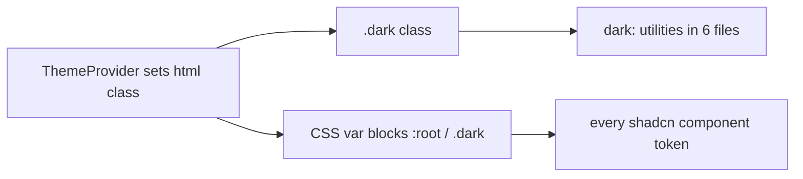

# Research Report: Theme Customization Feature

## Scope Recap
- **Model:** 1 axis, flat list of presets. Light + Dark are two presets; more color palettes (Material-style examples, more later) are additional presets. "Dark-ness" baked into each preset.
- **Hard constraint:** DATA-DRIVEN + EXTENSIBLE. Adding a new palette later = adding a data entry, not editing component logic.
- **Material = example only.** Other palette sources will come later.

## 1. Existing Patterns / Theme Mechanism

**`src/components/theme-provider.tsx`**
- `Theme` type (line 3): `"dark" | "light" | "system"` — exactly 3 values.
- Class application (lines 33–44): removes `"light"` + `"dark"` from `document.documentElement`, then adds resolved class. `system` resolves via `matchMedia("(prefers-color-scheme: dark)")` at render (NO live listener — runtime OS change doesn't re-apply).
- `storageKey` default `"lazysheet-theme"` (line 27), also passed in `main.tsx:27`.
- `initialState` (lines 16–19): `{ theme: "system", setTheme: () => null }`.

**`src/App.css`**
- Tailwind v4 imports (lines 1–4): `tailwindcss`, `tw-animate-css`, `shadcn/tailwind.css`, font.
- **Line 6 (CRITICAL):** `@custom-variant dark (&:is(.dark *));` — `dark:` utilities activate only under an ancestor with `.dark` class. Class-based, NOT `prefers-color-scheme`.
- `@theme inline` block (lines 8–49): maps Tailwind tokens → CSS vars.
- **CSS var set (31 properties)** defined in both `:root` (light, lines 51–84) and `.dark` (lines 86–118):
  `--background, --foreground, --card, --card-foreground, --popover, --popover-foreground, --primary, --primary-foreground, --secondary, --secondary-foreground, --muted, --muted-foreground, --accent, --accent-foreground, --destructive, --border, --input, --ring, --chart-1..5, --sidebar, --sidebar-foreground, --sidebar-primary, --sidebar-primary-foreground, --sidebar-accent, --sidebar-accent-foreground, --sidebar-border, --sidebar-ring`. Plus `--radius` (only in `:root`).
- All values are `oklch()`. The only non-gray value in either block: `.dark --sidebar-primary: oklch(0.488 0.243 264.376)`.
- `@layer base` (120–130): global border/bg/text. `.selection-ants` animation uses `stroke: var(--primary)`.

## 2. Dependency Map — `dark:` variant usage (CRITICAL)

`dark:` appears **13 className occurrences across 6 files**. These activate ONLY when `.dark` class present on an ancestor:
- `src/components/ui/tabs.tsx` (lines 64–66): active/hover tab states.
- `src/components/ui/button.tsx` (lines 8,14,18,20): destructive + outline states.
- `src/components/ui/dropdown-menu.tsx` (line 74): destructive focus.
- `src/components/ui/context-menu.tsx` (line 70): destructive focus.
- `src/components/mode-toggle.tsx` (lines 21–22): Sun/Moon icon rotate/scale animation.
- `src/components/QueryModal.tsx` (lines 294,299): `dark:text-amber-400`.

**Implication:** Any preset that is dark in character MUST carry the `.dark` class on `<html>`, otherwise these 13 utilities break. So a preset needs two facets: (a) its palette identity (which CSS var block to apply), and (b) its light/dark base (whether `.dark` is present). Design must apply BOTH a palette selector (e.g. `data-theme="..."`) AND keep the `.dark` class for dark presets.

## 3. Theme Consumers

| File | Line | Reference |
|---|---|---|
| `src/main.tsx` | 5, 27 | imports + `<ThemeProvider defaultTheme="system" storageKey="lazysheet-theme">` wraps app |
| `src/test/render.tsx` | 4, 14 | `<ThemeProvider>` (no props) in `AllProviders` |
| `src/components/mode-toggle.tsx` | 11, 14 | `const { setTheme } = useTheme()` |
| `src/components/theme-provider.test.tsx` | 3 | imports `ThemeProvider, useTheme` |
| `src/components/ui/sonner.tsx` | 3 | **DIVERGENT:** `useTheme` from `"next-themes"` (not our provider) |
| `src/components/ui/sonner.test.tsx` | 6 | mocks `next-themes` → `{ theme: "light" }` |

**`sonner.tsx` gotcha:** imports `useTheme` from `next-themes`, not from `@/components/theme-provider`. `next-themes` not wired in production → returns fallback. Sonner uses it only for its own toast styling. Decision needed: leave as-is (low risk) or point it at our provider (it expects `"light"|"dark"|"system"`).

## 4. i18n

- Config: `src/i18n/index.ts`. Languages: `en`, `id`, `zh`, `es`. Detector via localStorage when `flags.multiLang` on.
- `theme` object lives at **line 5** in each locale, keys exactly `toggle, light, dark, system`:
  - `src/locales/en.json`, `id.json`, `zh.json`, `es.json`.
- Test i18n: `src/test/i18n-test.ts` — en only, `lng: "en"`, no detection.

**Implication:** Adding palette labels needs i18n keys in all 4 locales. To stay extensible, palette display names could be data-driven (label in registry) with i18n keys per palette, OR a generic scheme. Need to decide naming for `theme.light`/`theme.dark` reuse vs new keys.

## 5. Test Landscape

- **`theme-provider.test.tsx`**: 3 tests — renders children/context, useTheme-outside-provider no-op, no-op setTheme. Doesn't test the line-65 throw guard.
- **`mode-toggle.test.tsx`**: 7 tests. **Line 73 asserts EXACTLY 3 menu items** (`findAllByRole("menuitem").length === 3`). Tests click Light/Dark/System, check `documentElement.classList`. testids: `theme-toggle-btn`, `theme-item-light/dark/system`.
- **e2e `e2e/specs/11-theme.e2e.ts`**: 2 tests — switch Dark → assert `html.classList.contains('dark')===true`; switch Light → assert `===false`. Uses `T.themeToggleBtn`, `openDropdownItem(...,"theme-item-dark"/"theme-item-light")`.
- Setup `src/test/render.tsx`: `renderWithProviders` wraps `I18nextProvider` + `ThemeProvider` (no props) + `TooltipProvider`.

**Implication:** The "exactly 3 menu items" assertion AND the e2e dark-class assertions WILL break when presets are added. Must update these tests as part of the feature. e2e still valid if dark presets carry `.dark` class.

## 6. shadcn / Tailwind Config

- `components.json`: style `radix-nova`, `css: src/App.css`, `baseColor: neutral`, `cssVariables: true`, icon `lucide`.
- `vite.config.ts`: Tailwind via `@tailwindcss/vite` plugin (lines 4,11). **No `tailwind.config.ts`** — all config is CSS-based in `App.css`.
- `package.json`: `tailwindcss ^4.3.0`, `@tailwindcss/vite ^4.3.0` → **Tailwind v4**.
- Theming is purely **class-based** via `@custom-variant dark`. **No `data-theme` attribute anywhere** currently.

## 7. Settings / UI Patterns

- **No settings/preferences panel exists.** No `Settings.tsx`.
- **`ModeToggle` + `LanguageToggle` are structurally identical**: ghost icon button `h-7 w-7`, `DropdownMenu` + `DropdownMenuContent align="end"`, items mapped from a list (`LanguageToggle` maps `SUPPORTED_LANGUAGES`). Both sit in `TitleBar.tsx` right controls (lines 125–128).
- `LanguageToggle` is the closest precedent for a **data-driven dropdown** (maps an array → menu items). Direct template for a palette picker.
- UI primitives in `src/components/ui/`: button, checkbox, context-menu, dialog, dropdown-menu, multi-select, popover, select, sonner, tabs, tooltip. **No radio-group, switch, or sheet.**

## 8. Open Questions (resolved by design choices — see Plan)

1. **Palette identity mechanism:** new `data-theme` attribute on `<html>` vs more classes. (Leaning `data-theme` + keep `.dark` class for dark presets — preserves all 13 `dark:` utilities.)
2. **i18n naming:** reuse `theme.light`/`theme.dark`; add per-palette label keys (e.g. `theme.palette.blue`) or carry labels in registry. Decide for extensibility.
3. **`sonner.tsx` next-themes:** leave as-is vs rewire. (Lean leave-as-is — out of scope, low risk.)
4. **`system` preset:** keep "System" as a special entry (follows OS light/dark) alongside named presets? Or drop. (Lean keep — backward compat + e2e/tests.)
5. **Test updates:** mode-toggle "exactly 3 items" + e2e dark-class — must update. Confirmed in-scope.
