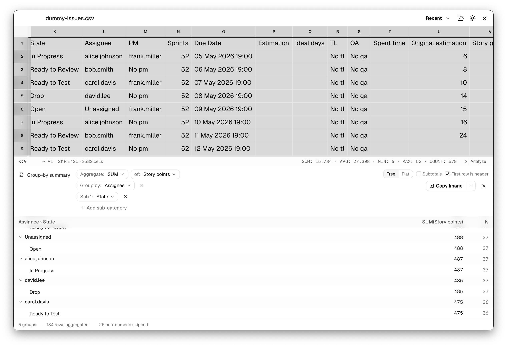

<div align="center">


# LazySheet — Landing Page

### Fast. Simple. Spreadsheet Viewer.

The marketing website for **LazySheet** — a fast, native viewer for Excel & CSV files.
Connect to Excel and CSV files, browse sheets, and run pivot-style summaries with ease.



</div>

> This repository contains **only the landing page source**.
> The LazySheet desktop app lives at **[triasbrata/lazysheet](https://github.com/triasbrata/lazysheet)**.

## Tech Stack

- **Framework:** [TanStack Start](https://tanstack.com/start) (React 19, SSR)
- **Routing:** [TanStack Router](https://tanstack.com/router) (file-based)
- **Styling:** [Tailwind CSS v4](https://tailwindcss.com)
- **UI:** [shadcn/ui](https://ui.shadcn.com)
- **Icons:** [Font Awesome](https://fontawesome.com) (React)
- **Deploy:** [Cloudflare Workers](https://workers.cloudflare.com) via [`@cloudflare/vite-plugin`](https://developers.cloudflare.com/workers/vite-plugin/)

## Pages

- `/` — hero, format support, and the feature grid.
- `/download` — per-OS download grid (macOS / Windows / Linux).

## Develop

```bash
npm install
npm run dev      # → http://localhost:3000
```

## Build

```bash
npm run build    # client + SSR worker bundle
npm run preview  # preview the production build
```

## Deploy (Cloudflare Workers)

```bash
npx wrangler login    # one-time browser auth
npm run deploy        # build + wrangler deploy
```

Worker name and compatibility settings live in [`wrangler.jsonc`](wrangler.jsonc).

## Project Layout

```
src/
  routes/
    __root.tsx        Document shell, <head> meta, Font Awesome setup
    index.tsx         Landing page (hero, formats, features)
    download.tsx      Per-OS download grid
  components/
    site/             Shared Nav, Footer, icons
    ui/               shadcn/ui primitives
  lib/                utils + Font Awesome config
  styles.css          Tailwind theme + design tokens
public/               app icon + product screenshots
```

## About LazySheet

LazySheet is a native desktop spreadsheet viewer built with Tauri + Rust. Highlights:

- **Wide format support** — `.xlsx`, `.xlsm`, `.xls`, `.csv`, `.tsv`.
- **Multi-sheet navigation**, **formatting preserved**, merged cells & frozen panes.
- **Group-by summary** — pivot-style SUM / AVG / MIN / MAX / COUNT, with subtotals.
- **Range selection stats**, **copy as image**, **drag & drop**, **Open With**, **recent files**.
- **Virtualized rendering** — large sheets stay smooth.

Get the app → **[triasbrata/lazysheet](https://github.com/triasbrata/lazysheet)**

## License

Released under the [MIT License](https://github.com/triasbrata/lazysheet/blob/main/LICENSE).
